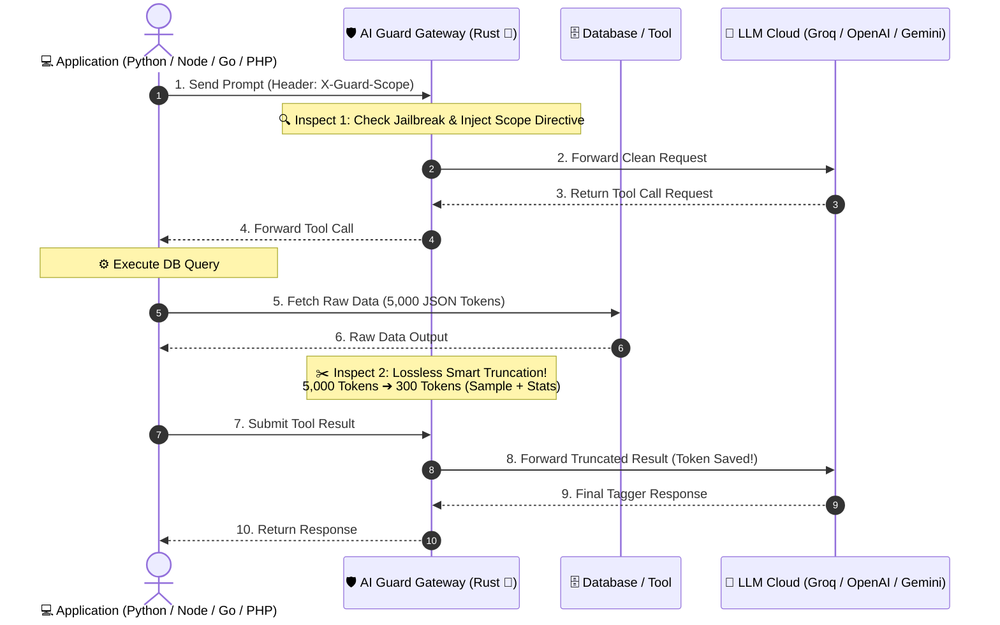

# 🛡️ AI Guard Gateway (Built with Rust 🦀)

[](https://www.rust-lang.org/)
[](https://opensource.org/licenses/MIT)
[](https://hub.docker.com/)
[](https://platform.openai.com/docs/api-reference)

An **ultra-high performance (<1ms latency overhead, ~10MB RAM usage)** OpenAI-compatible Security & Token Saver Reverse Proxy Gateway written in **Rust** using `Axum` and `Tokio`.

---

## 🌟 Key Features

- 🛡️ **Real-Time Prompt Injection & Jailbreak Shield**: Heuristic regex scanner that blocks malicious override prompts before they hit your cloud LLMs.
- 🔐 **Dynamic Scope & Context Injector**: Automatically injects organization/user scope boundary directives into system prompts via custom headers (`X-Guard-Scope`).
- ✂️ **Lossless Tool Result Payload Truncator (Token Saver Engine)**: Automatically truncates massive JSON array tool results to sample sizes without degrading AI intelligence, **saving up to ~90% on LLM API token costs**.
- 🚀 **OpenAI-Compatible Drop-In Proxy**: Works seamlessly with any application language (Python, Node.js, Go, PHP, Laravel) by simply updating the `baseURL` to `http://ai-guard-gateway:8080/v1`.
- ⚡ **Built with Rust 🦀**: Zero garbage collection pauses, ultra-fast async I/O with Axum/Tokio, and tiny ~15MB Docker image footprint.

---

## 📐 Architecture Overview



---

## ⚙️ Quickstart with Docker Compose

1. Clone the repository:
```bash
git clone https://github.com/brillianodhiya/AI-Guard-Gateway.git
cd AI-Guard-Gateway
```

2. Create `.env` file from example:
```bash
cp .env.example .env
```

3. Set your Cloud LLM API Key in `.env`:
```env
LLM_PROVIDER=groq
GROQ_API_KEY=gsk_your_actual_groq_api_key_here
```

4. Start the Gateway:
```bash
docker compose up -d
```
The Gateway is now listening on **`http://localhost:8080`**!

---

## 💻 Usage Examples

### 1. cURL
```bash
curl http://localhost:8080/v1/chat/completions \
  -H "Content-Type: application/json" \
  -H "X-Guard-Scope: Organization: AcmeCorp, Department: Finance" \
  -d '{
    "model": "qwen-2.5-72b-instruct",
    "messages": [
      {"role": "user", "content": "Tampilkan ringkasan perangkat"}
    ]
  }'
```

### 2. Node.js (OpenAI SDK / Vercel AI SDK)
```javascript
import { createOpenAI } from '@ai-sdk/openai';

const openai = createOpenAI({
  baseURL: 'http://localhost:8080/v1', // Point to AI Guard Gateway!
  apiKey: 'dummy_key' // Real key is securely stored in AI Guard Gateway
});
```

### 3. Python (OpenAI SDK)
```python
from openai import OpenAI

client = OpenAI(
    base_url="http://localhost:8080/v1",
    api_key="dummy_key"
)

response = client.chat.completions.create(
    model="llama-3.3-70b-versatile",
    messages=[{"role": "user", "content": "Hello!"}],
    extra_headers={"X-Guard-Scope": "Project Alpha"}
)
```

---

## 🧪 Building from Source (Rust)

Ensure you have [Rust](https://www.rust-lang.org/) installed (1.75+):

```bash
# Check compilation
cargo check

# Run locally in development mode
cargo run

# Build optimized release binary
cargo build --release
```

---

## 📄 License

Distributed under the MIT License. See `LICENSE` for more information.

Copyright (c) 2026 Brilliano Dhiya. All Rights Reserved.
